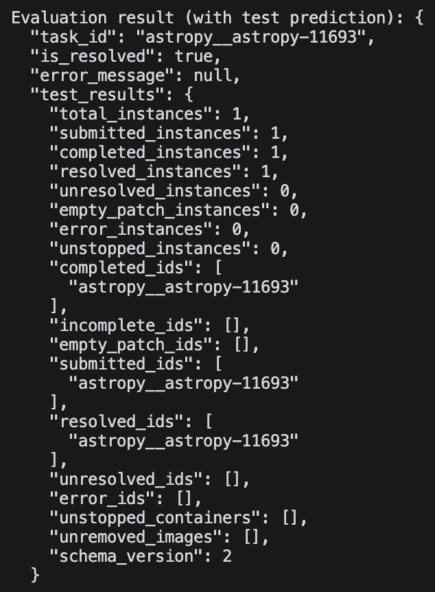

# API for SWE-Bench

## Install

```bash
python3 -m venv .venv
source .venv/bin/activate
pip install -r requirements.txt
```

## Run API Server

```bash
docker compose up -d
```

## Test API Server

```bash
python test_api.py
```
The result should be like this:


## Stop API Server

```bash
docker compose down
```